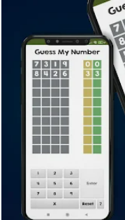
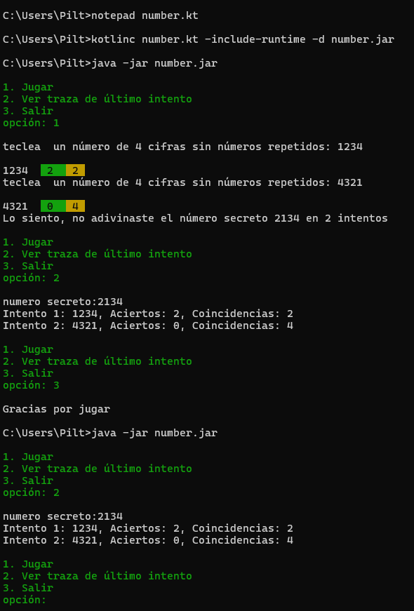

adivinanumeroenunciado

Se quiere hacer una versión consola de Guess a number.

La aplicación genera internamente un número aleatorio y el usuario debe adivinarlo en una serie de intentos. El usuario introduce un número y la aplicación le indicará respecto al número secreto cuantas cifras son aciertos y cuantas coincidencias. Coincidencia quiere decir que la cifra existe en el número secreto pero no en la misma posición y acierto que existe pero además está en la misma posición.

Aunque la aplicación sea de consola puedes inspirarte en alguna app android como Guess My Number

o bien en alguna versión web como 
[Numberle](https://kveez.com/en/numberle/#google_vignette)

SE PIDE:
- Una aplicación de consola que además sabemos compilarla y ejecutarla  desde la consola  real del sistema. Puedes consultar sobre esto en 
[compilar y ejecutar desde consola](https://manuais.pages.iessanclemente.net/apuntes/2.programacion/kotlin/01_prog_estructurada/018.kotlindesdeconsola/0181.compilaryejecutar/index.html)
- Puedes usar colores para mejorar presentación, puedes consultar sobre esto en 
[secuencias de escape ANSI](https://manuais.pages.iessanclemente.net/apuntes/2.programacion/kotlin/01_prog_estructurada/018.kotlindesdeconsola/0182.secuenciasescapeansi/index.html)
- Es de tu libre elección el número máximo de intentos, la longitud del número a adivinar y que digitos pueden forma dicho número. Pero no lo compliques mucho, por ejemplo, puede estar bien que la longitud del número sea de 4 cifras, no puede haber cifras repetidas, solo usamos digitos del 1 al 6 y el número máximo de intentos es 10.
- La última jugada se guarda de forma persistente en un fichero, de forma que incluso en la siguiente ejecución está accesible. Puedes consultar como grabar en un fichero de texto en los apuntes clase [strings en ficheros](https://manuais.pages.iessanclemente.net/apuntes/2.programacion/kotlin/01_prog_estructurada/017.algunasutilidades/0172.stringsenficheros/index.html)

Aquí tienes un ejemplo de ejecución. Puedes mejorar mucho esta presentación, pretende simplemente mostrar de forma sencilla la idea del juego.

